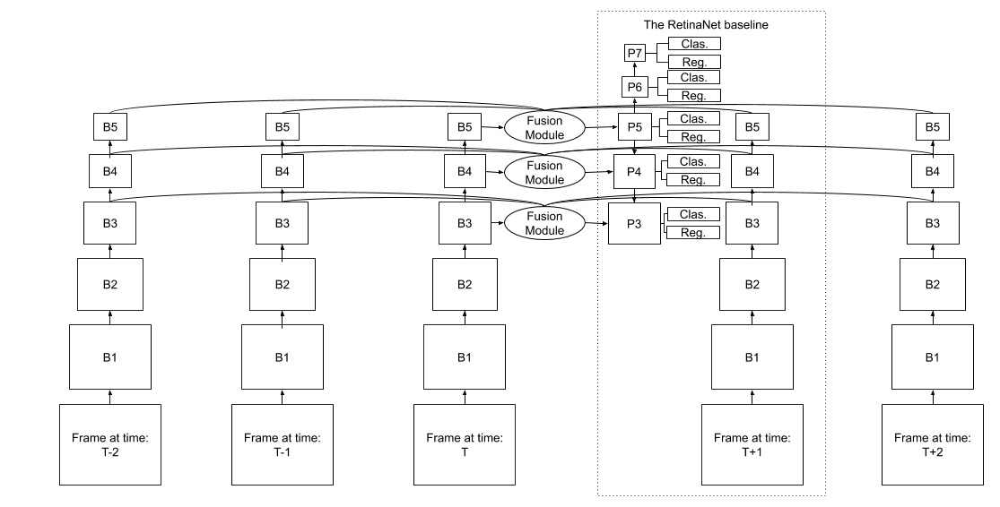
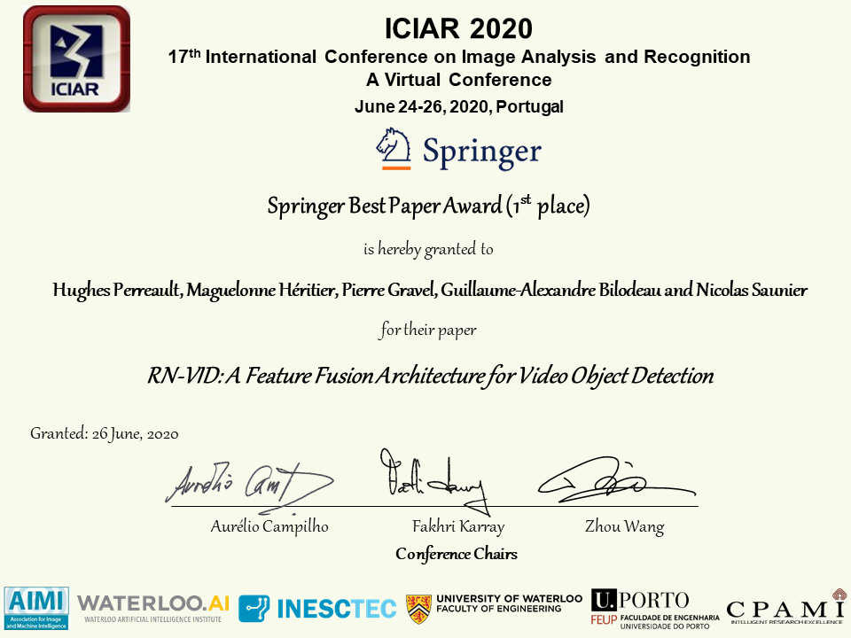

  
   
# RN-VID
Repository for the paper RN-VID: A Feature Fusion Architecture for Video Object Detection
  by Hughes Perreault1, Pierre Gravel2, Maguelonne Héritier2, Guillaume-Alexandre Bilodeau1 and Nicolas Saunier1.
 
1 Polytechnique Montréal
2 Genetec  
Paper: https://arxiv.org/abs/2003.10898

## Abstract
Consecutive frames in a video are highly redundant. Therefore, to perform the task of video object detection, executing single frame detectors on every frame without reusing any information is quite wasteful. It is with this idea in mind that we propose RN-VID (standing for RetinaNet-VIDeo), a novel approach to video object detection. Our contributions are twofold. First, we propose a new architecture that allows the usage of information from nearby frames to enhance feature maps. Second, we propose a novel module to merge feature maps of same dimensions using re-ordering of channels and 1 x 1 convolutions. We then demonstrate that RN-VID achieves better mean average precision (mAP) than corresponding single frame detectors with little additional cost during inference.

## Model

Each frame is passed through a pre-trained VGG-16, and the outputs of block 3, block 4 and block 5 are collected for fusion. B1 to B5 are the standard VGG-16 blocks, and P3 to P7 are the feature pyramid levels. In the dotted frame is an overview of our baseline, a RetinaNet with VGG-16 as a backbone.

  

Our fusion module consists of channel re-ordering, concatenation,1×1 convolution, and a final concatenation.

## Results

For the official references, please refer to the paper.

### Results on UA-DETRAC

| Model                                | Overall          | Easy             | Medium           | Hard             | Cloudy           | Night            | Rainy            | Sunny            |
|--------------------------------------|------------------|------------------|------------------|------------------|------------------|------------------|------------------|------------------|
| RN-VID (Ours)                        | 70.57%           | 87.50%           | 75.53%           | 58.04%           | 80.69%           | 69.56%           | 56.15%           | 83.60%           |
| R-FCN                                | 69.87%           | 93.32%           | 75.67%           | 54.31%           | 74.38%           | 75.09%           | 56.21%           | 84.08%           |
| RN-VGG16                             | 69.14%           | 86.82%           | 73.70%           | 56.74%           | 79.88%           | 66.57%           | 55.21%           | 82.09%           |
| EB                                   | 67.96%           | 89.65%           | 73.12%           | 53.64%           | 72.42%           | 73.93%           | 53.40%           | 83.73%           |
| Faster R-CNN                         | 58.45%           | 82.75%           | 63.05%           | 44.25%           | 66.29%           | 69.85%           | 45.16%           | 62.34%           |
| YOLOv2                               | 57.72%           | 83.28%           | 62.25%           | 42.44%           | 57.97%           | 64.53%           | 47.84%           | 69.75%           |
| RN-D                                 | 54.69%           | 80.98%           | 59.13%           | 39.23%           | 59.88%           | 54.62%           | 41.11%           | 77.53%           |
| 3D-DETnet                            | 53.30%           | 66.66%           | 59.26%           | 43.22%           | 63.30%           | 52.90%           | 44.27%           | 71.26%           |

### Results on UAVDT

| Model                            | Overall          |
|----------------------------------|------------------|
| RN-VID (Ours)                    | 39.43%           |
| RN-VGG16                         | 38.26%           |
| R-FCN                            | 34.35%           |
| SSD                              | 33.62%           |
| Faster-RCNN                      | 22.32%           |
| RON                              | 21.59%           |

## Award

This paper was awarded the best paper award at the ICIAR 2020 conference.

## Acknowledgements
The code for this paper is mainly built upon [keras-retinanet](https://github.com/fizyr/keras-retinanet), we would therefore like to thank the authors for providing their source code. We also acknowledge the support of the Natural Sciences and Engineering Research Council of Canada (NSERC), [RDCPJ 508883 - 17], and the support of Genetec.

## License

RN-VID is released under the MIT License. Portions of the code are borrowed from [keras-retinanet](https://github.com/fizyr/keras-retinanet). Please refer to the original License of this project.
